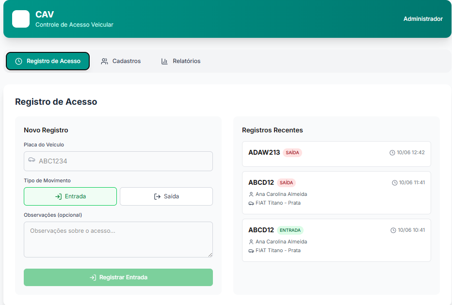
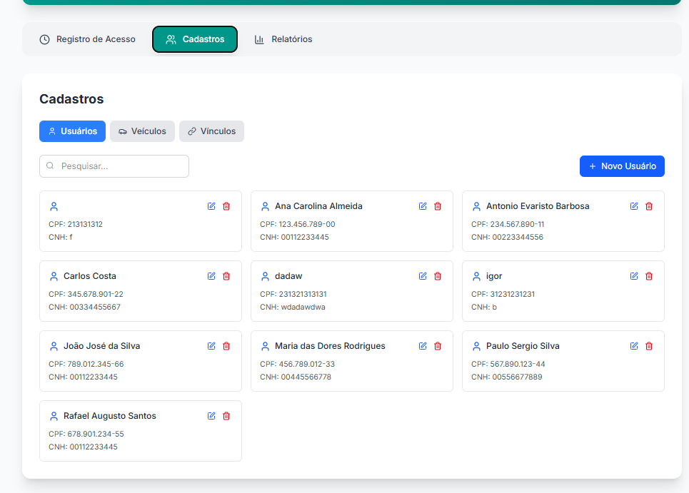
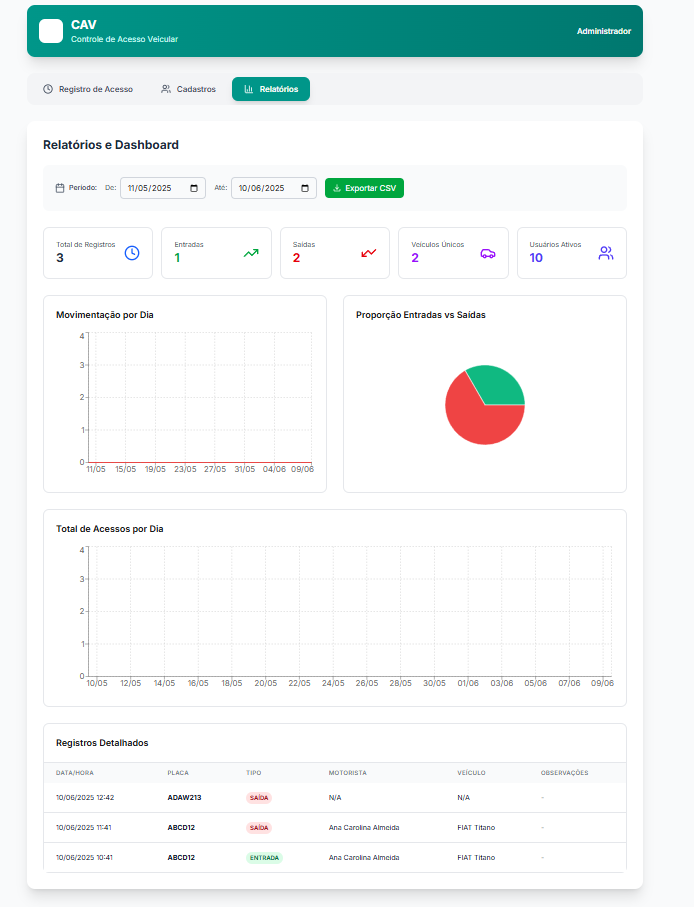
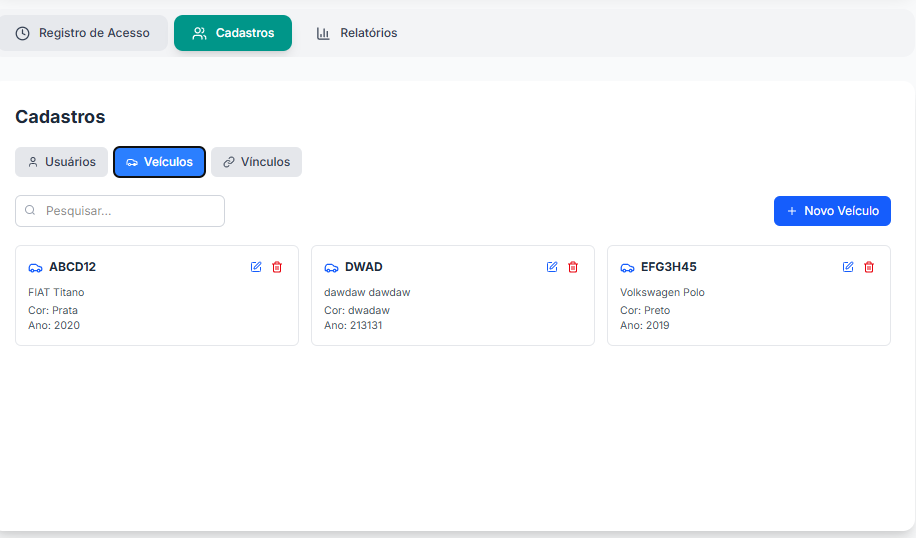

# 🚗 Sistema CAV - Controle de Acesso Veicular

Sistema moderno e responsivo para controle de entrada e saída de veículos, desenvolvido com Next.js 14, TypeScript e Supabase. Projeto para a faculdade, desenvolvido por Igor Oliveira


## 🖼️ Screenshots do Sistema

### Dashboard Principal


_Interface principal com navegação intuitiva e design moderno_

### Gestão de Cadastros


_Sistema de cadastro com upload de fotos e interface responsiva_

### Relatórios e Analytics


_Gráficos interativos e estatísticas em tempo real_

### Histórico de Veículos


_Gerenciamento completo de veículos cadastrados_

## 📋 Sobre o Projeto

O Sistema CAV foi desenvolvido para modernizar o controle de acesso veicular em empresas, substituindo planilhas Excel por uma solução web moderna, segura e eficiente. O sistema opera 24/7 na nuvem, oferecendo maior confiabilidade e reduzindo custos com hardware.

### 🎯 Problema Identificado

- Sistema obsoleto baseado em Excel
- Interface limitada e pouco intuitiva
- Dependência de hardware potente local
- Falta de disponibilidade contínua
- Dificuldade para múltiplos usuários simultâneos

### ✨ Solução Implementada

- Interface web moderna e responsiva
- Banco de dados otimizado (PostgreSQL via Supabase)
- Hospedagem em nuvem com alta disponibilidade
- Acesso multiusuário com diferentes níveis de permissão
- Relatórios automatizados e dashboards visuais
- Sistema de upload de fotos integrado

## 🚀 Funcionalidades

### 📊 Dashboard e Relatórios


- **Estatísticas em tempo real**: Total de registros, entradas, saídas, veículos únicos
- **Gráficos interativos**: Movimentação por dia, proporção entradas vs saídas
- **Filtros por período**: Análise customizada de datas
- **Exportação CSV**: Relatórios detalhados para análise externa
- **Tabela de registros**: Visualização completa dos acessos

### 🚗 Controle de Acesso

- **Registro rápido**: Interface otimizada para entrada/saída
- **Busca automática**: Identificação de veículos e motoristas por placa
- **Validação inteligente**: Verificação de dados cadastrados
- **Observações**: Campo livre para anotações específicas
- **Histórico em tempo real**: Lista dos registros mais recentes

### 👥 Gestão de Usuários


- **Cadastro completo**: Nome, CPF, data de nascimento, habilitação
- **Upload de fotos**: Sistema integrado com Supabase Storage
- **Preview de imagens**: Visualização imediata das fotos
- **Busca inteligente**: Pesquisa por nome ou CPF
- **Exclusão lógica**: Inativação segura sem perda de dados

### 🚙 Gestão de Veículos


- **Dados completos**: Placa, marca, modelo, cor, ano
- **Formatação automática**: Placas em maiúsculo
- **Validação de dados**: Verificação de formato e duplicatas
- **Organização por placa**: Listagem ordenada e intuitiva

## 🛠️ Tecnologias Utilizadas

### Frontend

- **Next.js 14**: Framework React com App Router
- **TypeScript**: Tipagem estática para maior segurança
- **Tailwind CSS**: Framework CSS utilitário
- **Lucide React**: Ícones modernos e consistentes
- **Recharts**: Gráficos interativos e responsivos
- **date-fns**: Manipulação avançada de datas

### Backend & Database

- **Supabase**: Backend-as-a-Service completo
- **PostgreSQL**: Banco de dados relacional robusto
- **Supabase Storage**: Armazenamento de arquivos na nuvem
- **Row Level Security**: Segurança de dados avançada

### Infraestrutura

- **Vercel**: Hospedagem e deploy contínuo
- **CDN Global**: Performance otimizada mundialmente
- **HTTPS**: Conexões seguras por padrão

## 📱 Design e UX

### Responsividade

- **Mobile First**: Design otimizado para dispositivos móveis
- **Breakpoints adaptativos**: Layout flexível para todas as telas
- **Touch-friendly**: Elementos otimizados para toque
- **Performance**: Carregamento rápido em todas as conexões

### Interface Moderna


- **Design System**: Cores teal/verde-azulado consistentes
- **Glassmorphism**: Efeitos visuais modernos
- **Micro-interações**: Feedback visual em todas as ações
- **Acessibilidade**: Contraste adequado e navegação por teclado

## 🚀 Instalação e Configuração

### Pré-requisitos

- Node.js 18+
- Git
- Conta no Supabase
- Conta no Vercel (para deploy)

### 1. Clonando o Repositório

```bash
git clone https://github.com/seu-usuario/sistema-cav.git
cd sistema-cav
```

### 2. Instalando Dependências

```bash
npm install
```

### 3. Configuração do Supabase

#### 3.1 Criando o Projeto

1. Acesse [supabase.com](https://supabase.com)
2. Crie um novo projeto
3. Anote a URL e chave anônima do projeto

#### 3.2 Configurando o Banco de Dados

Execute o SQL no editor do Supabase:

```sql
-- Criação das tabelas para o Sistema CAV

-- Tabela de usuários (motoristas)
CREATE TABLE usuarios (
    id UUID DEFAULT gen_random_uuid() PRIMARY KEY,
    nome VARCHAR(255) NOT NULL,
    cpf VARCHAR(14) UNIQUE NOT NULL,
    data_nascimento DATE,
    habilitacao VARCHAR(20),
    foto_url TEXT,
    ativo BOOLEAN DEFAULT true,
    created_at TIMESTAMP WITH TIME ZONE DEFAULT NOW(),
    updated_at TIMESTAMP WITH TIME ZONE DEFAULT NOW()
);

-- Tabela de veículos
CREATE TABLE veiculos (
    id UUID DEFAULT gen_random_uuid() PRIMARY KEY,
    placa VARCHAR(8) UNIQUE NOT NULL,
    marca VARCHAR(100) NOT NULL,
    modelo VARCHAR(100) NOT NULL,
    cor VARCHAR(50) NOT NULL,
    ano INTEGER,
    foto_url TEXT,
    ativo BOOLEAN DEFAULT true,
    created_at TIMESTAMP WITH TIME ZONE DEFAULT NOW(),
    updated_at TIMESTAMP WITH TIME ZONE DEFAULT NOW()
);

-- Tabela de registros de entrada/saída
CREATE TABLE registros_acesso (
    id UUID DEFAULT gen_random_uuid() PRIMARY KEY,
    usuario_id UUID REFERENCES usuarios(id),
    veiculo_id UUID REFERENCES veiculos(id),
    placa VARCHAR(8) NOT NULL,
    tipo_movimento VARCHAR(10) CHECK (tipo_movimento IN ('entrada', 'saida')) NOT NULL,
    data_hora TIMESTAMP WITH TIME ZONE DEFAULT NOW(),
    observacoes TEXT,
    foto_url TEXT,
    created_at TIMESTAMP WITH TIME ZONE DEFAULT NOW()
);

-- Configuração do Storage para fotos
INSERT INTO storage.buckets (id, name, public) VALUES ('fotos', 'fotos', true);

-- Políticas de segurança para storage
CREATE POLICY "Permitir upload de fotos" ON storage.objects
FOR INSERT WITH CHECK (bucket_id = 'fotos');

CREATE POLICY "Permitir visualização de fotos" ON storage.objects
FOR SELECT USING (bucket_id = 'fotos');
```

### 4. Variáveis de Ambiente

Crie o arquivo `.env.local`:

```bash
NEXT_PUBLIC_SUPABASE_URL=sua_url_do_supabase
NEXT_PUBLIC_SUPABASE_ANON_KEY=sua_chave_anonima
```

### 5. Executando Localmente

```bash
npm run dev
```

Acesse: http://localhost:3000

## 🌐 Deploy em Produção

### Vercel (Recomendado)

1. Conecte seu repositório GitHub à Vercel
2. Configure as variáveis de ambiente
3. Deploy automático a cada push na branch main

### Outras Plataformas

- **Netlify**: Suporte completo ao Next.js
- **Railway**: Deploy direto do Git
- **Heroku**: Com buildpack do Next.js

## 📊 Estrutura do Projeto

```
sistema-cav/
├── src/
│   ├── app/
│   │   ├── globals.css
│   │   ├── layout.tsx
│   │   └── page.tsx
│   ├── components/
│   │   ├── CadastroTab.tsx
│   │   ├── RegistroTab.tsx
│   │   └── RelatoriosTab.tsx
│   └── lib/
│       └── supabase.ts
├── public/
│   ├── inicial.png
│   ├── cadastro.png
│   ├── relatorios.png
│   ├── veiculos.png
│   └── vinculos.png
├── .env.local
├── package.json
├── tailwind.config.js
├── tsconfig.json
└── README.md
```

## 🔒 Segurança e Performance

### Segurança

- **Row Level Security**: Políticas de acesso no banco de dados
- **Validação de tipos**: TypeScript para prevenção de erros
- **Sanitização de dados**: Limpeza automática de inputs
- **HTTPS obrigatório**: Conexões criptografadas

### Performance

- **Server-Side Rendering**: Carregamento otimizado
- **Image Optimization**: Compressão automática de imagens
- **Code Splitting**: Carregamento sob demanda
- **CDN Global**: Distribuição worldwide

## 🤝 Contribuindo

1. Fork o projeto
2. Crie uma branch para sua feature (`git checkout -b feature/AmazingFeature`)
3. Commit suas mudanças (`git commit -m 'Add some AmazingFeature'`)
4. Push para a branch (`git push origin feature/AmazingFeature`)
5. Abra um Pull Request

### Padrões de Código

- **ESLint**: Linting automático
- **Prettier**: Formatação consistente
- **TypeScript**: Tipagem obrigatória
- **Conventional Commits**: Mensagens padronizadas

## 📈 Roadmap Futuro

### Versão 2.0

- [ ] **Autenticação**: Sistema de login multiusuário
- [ ] **Permissões**: Diferentes níveis de acesso
- [ ] **API Externa**: Integração com dados de veículos
- [ ] **Notificações**: Alertas em tempo real
- [ ] **App Mobile**: Versão nativa iOS/Android

### Melhorias Planejadas

- [ ] **OCR**: Reconhecimento automático de placas
- [ ] **Relatórios avançados**: BI integrado
- [ ] **Backup automático**: Redundância de dados
- [ ] **Integração câmeras**: Captura automática
- [ ] **Dashboard executivo**: Métricas gerenciais

## 📞 Suporte e Contato

- **Documentação**: [Wiki do Projeto](link-wiki)
- **Issues**: [GitHub Issues](link-issues)
- **Email**: contato@sistema-cav.com
- **Discord**: [Servidor da Comunidade](link-discord)

## 📄 Licença

Este projeto está sob a licença MIT. Veja o arquivo [LICENSE](LICENSE) para detalhes.

## 🙏 Agradecimentos

- **Equipe de Desenvolvimento**: Pela dedicação e inovação
- **Supabase**: Pela infraestrutura robusta
- **Vercel**: Pela hospedagem eficiente
- **Comunidade Open Source**: Pelas bibliotecas utilizadas

---

**Desenvolvido com 💚 pela equipe do Sistema CAV**

_Transformando o controle de acesso veicular através da tecnologia_

O Sistema CAV foi desenvolvido para modernizar o controle de acesso veicular em empresas, substituindo planilhas Excel por uma solução web moderna, segura e eficiente. O sistema opera 24/7 na nuvem, oferecendo maior confiabilidade e reduzindo custos com hardware.

### 🎯 Problema Identificado

- Sistema obsoleto baseado em Excel
- Interface limitada e pouco intuitiva
- Dependência de hardware potente local
- Falta de disponibilidade contínua
- Dificuldade para múltiplos usuários simultâneos

### ✨ Solução Implementada

- Interface web moderna e responsiva
- Banco de dados otimizado (PostgreSQL via Supabase)
- Hospedagem em nuvem com alta disponibilidade
- Acesso multiusuário com diferentes níveis de permissão
- Relatórios automatizados e dashboards visuais
- Sistema de upload de fotos integrado

## 🚀 Funcionalidades

### 📊 Dashboard e Relatórios

- **Estatísticas em tempo real**: Total de registros, entradas, saídas, veículos únicos
- **Gráficos interativos**: Movimentação por dia, proporção entradas vs saídas
- **Filtros por período**: Análise customizada de datas
- **Exportação CSV**: Relatórios detalhados para análise externa
- **Tabela de registros**: Visualização completa dos acessos

### 🚗 Controle de Acesso

- **Registro rápido**: Interface otimizada para entrada/saída
- **Busca automática**: Identificação de veículos e motoristas por placa
- **Validação inteligente**: Verificação de dados cadastrados
- **Observações**: Campo livre para anotações específicas
- **Histórico em tempo real**: Lista dos registros mais recentes

### 👥 Gestão de Usuários

- **Cadastro completo**: Nome, CPF, data de nascimento, habilitação
- **Upload de fotos**: Sistema integrado com Supabase Storage
- **Preview de imagens**: Visualização imediata das fotos
- **Busca inteligente**: Pesquisa por nome ou CPF
- **Exclusão lógica**: Inativação segura sem perda de dados

### 🚙 Gestão de Veículos

- **Dados completos**: Placa, marca, modelo, cor, ano
- **Formatação automática**: Placas em maiúsculo
- **Validação de dados**: Verificação de formato e duplicatas
- **Organização por placa**: Listagem ordenada e intuitiva

## 🛠️ Tecnologias Utilizadas

### Frontend

- **Next.js 14**: Framework React com App Router
- **TypeScript**: Tipagem estática para maior segurança
- **Tailwind CSS**: Framework CSS utilitário
- **Lucide React**: Ícones modernos e consistentes
- **Recharts**: Gráficos interativos e responsivos
- **date-fns**: Manipulação avançada de datas

### Backend & Database

- **Supabase**: Backend-as-a-Service completo
- **PostgreSQL**: Banco de dados relacional robusto
- **Supabase Storage**: Armazenamento de arquivos na nuvem
- **Row Level Security**: Segurança de dados avançada

### Infraestrutura

- **Vercel**: Hospedagem e deploy contínuo
- **CDN Global**: Performance otimizada mundialmente
- **HTTPS**: Conexões seguras por padrão

## 📱 Design e UX

### Responsividade

- **Mobile First**: Design otimizado para dispositivos móveis
- **Breakpoints adaptativos**: Layout flexível para todas as telas
- **Touch-friendly**: Elementos otimizados para toque
- **Performance**: Carregamento rápido em todas as conexões

### Interface Moderna

- **Design System**: Cores teal/verde-azulado consistentes
- **Glassmorphism**: Efeitos visuais modernos
- **Micro-interações**: Feedback visual em todas as ações
- **Acessibilidade**: Contraste adequado e navegação por teclado

## 🚀 Instalação e Configuração

### Pré-requisitos

- Node.js 18+
- Git
- Conta no Supabase
- Conta no Vercel (para deploy)

### 1. Clonando o Repositório

```bash
git clone https://github.com/seu-usuario/sistema-cav.git
cd sistema-cav
```

### 2. Instalando Dependências

```bash
npm install
```

### 3. Configuração do Supabase

#### 3.1 Criando o Projeto

1. Acesse [supabase.com](https://supabase.com)
2. Crie um novo projeto
3. Anote a URL e chave anônima do projeto

#### 3.2 Configurando o Banco de Dados

Execute o SQL no editor do Supabase:

```sql
-- Criação das tabelas para o Sistema CAV

-- Tabela de usuários (motoristas)
CREATE TABLE usuarios (
    id UUID DEFAULT gen_random_uuid() PRIMARY KEY,
    nome VARCHAR(255) NOT NULL,
    cpf VARCHAR(14) UNIQUE NOT NULL,
    data_nascimento DATE,
    habilitacao VARCHAR(20),
    foto_url TEXT,
    ativo BOOLEAN DEFAULT true,
    created_at TIMESTAMP WITH TIME ZONE DEFAULT NOW(),
    updated_at TIMESTAMP WITH TIME ZONE DEFAULT NOW()
);

-- Tabela de veículos
CREATE TABLE veiculos (
    id UUID DEFAULT gen_random_uuid() PRIMARY KEY,
    placa VARCHAR(8) UNIQUE NOT NULL,
    marca VARCHAR(100) NOT NULL,
    modelo VARCHAR(100) NOT NULL,
    cor VARCHAR(50) NOT NULL,
    ano INTEGER,
    foto_url TEXT,
    ativo BOOLEAN DEFAULT true,
    created_at TIMESTAMP WITH TIME ZONE DEFAULT NOW(),
    updated_at TIMESTAMP WITH TIME ZONE DEFAULT NOW()
);

-- Tabela de registros de entrada/saída
CREATE TABLE registros_acesso (
    id UUID DEFAULT gen_random_uuid() PRIMARY KEY,
    usuario_id UUID REFERENCES usuarios(id),
    veiculo_id UUID REFERENCES veiculos(id),
    placa VARCHAR(8) NOT NULL,
    tipo_movimento VARCHAR(10) CHECK (tipo_movimento IN ('entrada', 'saida')) NOT NULL,
    data_hora TIMESTAMP WITH TIME ZONE DEFAULT NOW(),
    observacoes TEXT,
    foto_url TEXT,
    created_at TIMESTAMP WITH TIME ZONE DEFAULT NOW()
);

-- Configuração do Storage para fotos
INSERT INTO storage.buckets (id, name, public) VALUES ('fotos', 'fotos', true);

-- Políticas de segurança para storage
CREATE POLICY "Permitir upload de fotos" ON storage.objects
FOR INSERT WITH CHECK (bucket_id = 'fotos');

CREATE POLICY "Permitir visualização de fotos" ON storage.objects
FOR SELECT USING (bucket_id = 'fotos');
```

### 4. Variáveis de Ambiente

Crie o arquivo `.env.local`:

```bash
NEXT_PUBLIC_SUPABASE_URL=sua_url_do_supabase
NEXT_PUBLIC_SUPABASE_ANON_KEY=sua_chave_anonima
```

### 5. Executando Localmente

```bash
npm run dev
```

Acesse: http://localhost:3000

## 🌐 Deploy em Produção

### Vercel (Recomendado)

1. Conecte seu repositório GitHub à Vercel
2. Configure as variáveis de ambiente
3. Deploy automático a cada push na branch main

### Outras Plataformas

- **Netlify**: Suporte completo ao Next.js
- **Railway**: Deploy direto do Git
- **Heroku**: Com buildpack do Next.js

## 📊 Estrutura do Projeto

```
sistema-cav/
├── src/
│   ├── app/
│   │   ├── globals.css
│   │   ├── layout.tsx
│   │   └── page.tsx
│   ├── components/
│   │   ├── CadastroTab.tsx
│   │   ├── RegistroTab.tsx
│   │   └── RelatoriosTab.tsx
│   └── lib/
│       └── supabase.ts
├── public/
├── .env.local
├── package.json
├── tailwind.config.js
├── tsconfig.json
└── README.md
```

## 🔒 Segurança e Performance

### Segurança

- **Row Level Security**: Políticas de acesso no banco de dados
- **Validação de tipos**: TypeScript para prevenção de erros
- **Sanitização de dados**: Limpeza automática de inputs
- **HTTPS obrigatório**: Conexões criptografadas

### Performance

- **Server-Side Rendering**: Carregamento otimizado
- **Image Optimization**: Compressão automática de imagens
- **Code Splitting**: Carregamento sob demanda
- **CDN Global**: Distribuição worldwide

## 🤝 Contribuindo

1. Fork o projeto
2. Crie uma branch para sua feature (`git checkout -b feature/AmazingFeature`)
3. Commit suas mudanças (`git commit -m 'Add some AmazingFeature'`)
4. Push para a branch (`git push origin feature/AmazingFeature`)
5. Abra um Pull Request

### Padrões de Código

- **ESLint**: Linting automático
- **Prettier**: Formatação consistente
- **TypeScript**: Tipagem obrigatória
- **Conventional Commits**: Mensagens padronizadas

## 📈 Roadmap Futuro

### Versão 2.0

- [ ] **Autenticação**: Sistema de login multiusuário
- [ ] **Permissões**: Diferentes níveis de acesso
- [ ] **API Externa**: Integração com dados de veículos
- [ ] **Notificações**: Alertas em tempo real
- [ ] **App Mobile**: Versão nativa iOS/Android

### Melhorias Planejadas

- [ ] **OCR**: Reconhecimento automático de placas
- [ ] **Relatórios avançados**: BI integrado
- [ ] **Backup automático**: Redundância de dados
- [ ] **Integração câmeras**: Captura automática
- [ ] **Dashboard executivo**: Métricas gerenciais


